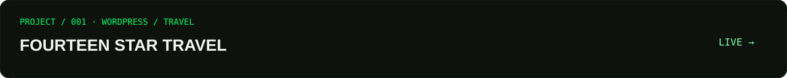
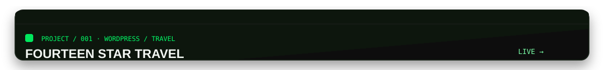

<!-- HERO -->

<code>[ AVAILABLE FOR NEW PROJECTS ]</code> · <code>[ WORDPRESS ]</code> · <code>[ AI AUTOMATION ]</code>

<h1 align="center">Hi, I'm Hamza Qadeer.</h1>

<strong>WordPress Developer · AI Automation Specialist · Full-Stack Developer</strong>

I build high-performance WordPress websites, modern web applications, and intelligent automation systems that help businesses work smarter.

  <a href="https://hamzaqadeer.netlify.app"><strong>VIEW MY PORTFOLIO →</strong></a> ·
  <a href="https://github.com/webd2276"><strong>GITHUB →</strong></a> ·
  <a href="https://hamzaqadeer.netlify.app"><strong>CONTACT ME →</strong></a>

<!-- DEVELOPER SNAPSHOT -->
<h2>Developer Snapshot</h2>

<!-- ABOUT -->

<code>[ ABOUT ME ]</code>

<h2>Building Digital Systems, Not Just Websites.</h2>

I’m Hamza Qadeer, a WordPress Developer and AI Automation Specialist focused on building modern websites, e-commerce experiences, custom web solutions, and intelligent business workflows.

My work spans WordPress, WooCommerce, Elementor, performance optimization, React, TypeScript, API integrations, n8n workflows, AI agents, and full-stack development. I care about practical solutions: clear interfaces, maintainable code, and systems that are useful after launch.

<!-- WHAT I BUILD -->
<h2>What I Build</h2>
<table>
  <tr><td width="50%"><strong>01 · WORDPRESS DEVELOPMENT</strong> Custom websites · Elementor · WooCommerce · themes · plugins · performance</td><td width="50%"><strong>02 · AI AUTOMATION</strong> n8n workflows · AI agents · API integrations · data processing</td></tr>
  <tr><td><strong>03 · FULL-STACK DEVELOPMENT</strong> React · TypeScript · Node.js · REST APIs · modern web applications</td><td><strong>04 · E-COMMERCE</strong> WooCommerce · product systems · checkout experiences · payments</td></tr>
  <tr><td><strong>05 · AI AGENTS</strong> Chat agents · voice agents · business assistants · tool integrations</td><td><strong>06 · WEB PERFORMANCE</strong> Core Web Vitals · caching · asset optimization · technical SEO</td></tr>
</table>

<!-- TECH STACK -->
<h2>Tech Stack</h2>
<table>
  <tr><td><strong>FRONTEND</strong></td><td><code>HTML</code> <code>CSS</code> <code>JavaScript</code> <code>React</code> <code>TypeScript</code> <code>Tailwind CSS</code></td></tr>
  <tr><td><strong>WORDPRESS</strong></td><td><code>WordPress</code> <code>Elementor Pro</code> <code>WooCommerce</code> <code>WPBakery</code> <code>Beaver Builder</code> <code>Astra</code> <code>Custom Plugins</code></td></tr>
  <tr><td><strong>BACKEND</strong></td><td><code>Node.js</code> <code>Express</code> <code>REST APIs</code> <code>MongoDB</code> <code>SQLite</code></td></tr>
  <tr><td><strong>AI & AUTOMATION</strong></td><td><code>n8n</code> <code>Gemini</code> <code>AI Agents</code> <code>Voice AI</code> <code>APIs</code> <code>Make</code> <code>Zapier</code></td></tr>
  <tr><td><strong>CREATIVE WEB</strong></td><td><code>Three.js</code> <code>GSAP</code> <code>Framer Motion</code></td></tr>
  <tr><td><strong>DEV TOOLS</strong></td><td><code>Git</code> <code>GitHub</code> <code>VS Code</code> <code>Linux</code> <code>Docker</code></td></tr>
</table>

<!-- PROJECTS -->
<h2>Featured Projects</h2>

<strong>Fourteen Star Travel</strong> · WordPress / Travel / Business Website

A professional travel and tourism website built around structured service presentation, responsive layouts, and scalable WordPress content.

<a href="https://fourteenstartravels.ae">LIVE PROJECT →</a>

<strong>La Forge</strong> · WooCommerce / E-commerce

A premium perfume e-commerce experience focused on product presentation, responsive shopping experience, and WooCommerce functionality.

<a href="https://laforge.com.pk">LIVE PROJECT →</a>

<!-- AUTOMATION -->

<code>[ AUTOMATE THE BORING STUFF ]</code>

<h2>AI Automation</h2>

<strong>Designing intelligent workflows that connect tools, data, AI models, and business processes.</strong>

<table>
  <tr><td><strong>LEAD AUTOMATION</strong> Form → AI classification → CRM → notification</td><td><strong>CONTENT AUTOMATION</strong> RSS → AI processing → formatting → publishing</td></tr>
  <tr><td><strong>CUSTOMER SUPPORT</strong> Message → AI agent → knowledge → response</td><td><strong>VOICE AI</strong> Call → voice agent → AI → CRM → follow-up</td></tr>
</table>

These are capability patterns and workflow directions, not claims that every flow is deployed in production.

<!-- GITHUB -->
<h2>Open Source & GitHub</h2>

Explore my <a href="https://github.com/webd2276">repositories, contribution graph, and live GitHub activity</a>. Metrics remain on GitHub so they stay current and verifiable rather than being hard-coded here.

<!-- CURRENT FOCUS -->
<h2>Currently Building</h2>
<table>
  <tr><td><code>● FOCUS</code> <strong>AI-powered automation</strong> n8n workflows, API connections, and practical business systems.</td><td><code>● EXPLORING</code> <strong>AI agents & voice AI</strong> Assistants that connect conversation, knowledge, tools, and action.</td><td><code>● BUILDING</code> <strong>Modern WordPress systems</strong> Fast, maintainable websites and e-commerce experiences.</td></tr>
</table>

<!-- PROCESS -->
<h2>How I Build</h2>
<table>
  <tr><td><strong>01 — UNDERSTAND</strong> Understand the business problem.</td><td><strong>02 — DESIGN</strong> Create a clear, scalable solution.</td><td><strong>03 — BUILD</strong> Develop clean, maintainable systems.</td><td><strong>04 — OPTIMIZE</strong> Improve performance, usability, and reliability.</td></tr>
</table>

<!-- CONTACT -->

<h2>Let's Build Something Useful.</h2>

Have a website, automation system, AI agent, or digital product in mind? Let’s turn the idea into something real.

<a href="https://hamzaqadeer.netlify.app"><strong>START A PROJECT →</strong></a> · <a href="https://hamzaqadeer.netlify.app"><strong>EMAIL ME →</strong></a> · <a href="https://hamzaqadeer.netlify.app"><strong>VIEW PORTFOLIO →</strong></a>

<!-- FOOTER -->

<strong>DIGITAL WAVES</strong> Hamza Qadeer WordPress Developer · AI Automation Specialist

<a href="https://github.com/webd2276">GitHub</a> · <a href="https://hamzaqadeer.netlify.app">Portfolio</a>

Built with code, curiosity & automation. © Hamza Qadeer

