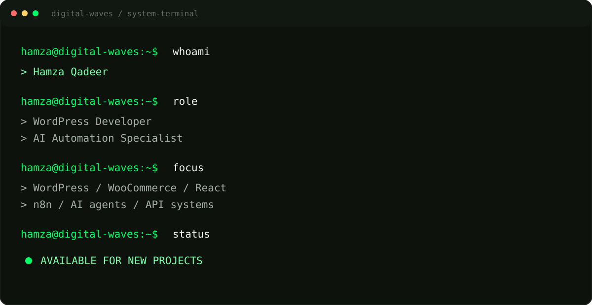
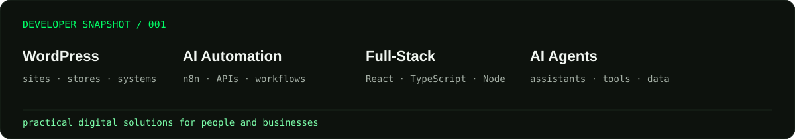
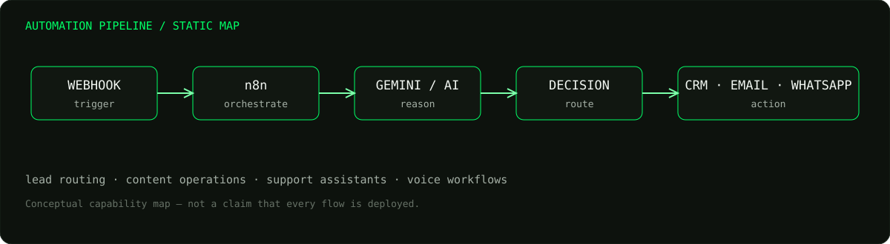
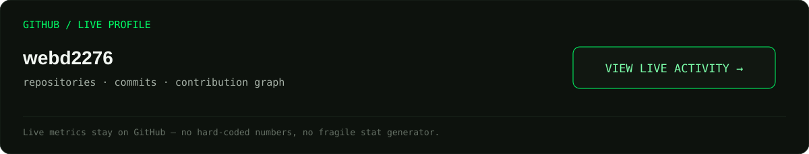

<!-- ============================================================
     HAMZA QADEER · DIGITAL WAVES — GitHub Profile README
     Assets live in /assets. github-dashboard.svg is regenerated daily
     by .github/workflows/update-dashboard.yml from real public data.
     TODO before publishing: replace YOUR_EMAIL_HERE (search this file).
     ============================================================ -->

<!-- HERO -->

  

<h1>Hi, I'm Hamza Qadeer</h1>

<b>WordPress Developer</b> · <b>AI Automation Specialist</b> · <b>Full-Stack Developer</b>

I build high-performance WordPress websites, modern web applications, 
and intelligent automation systems that help businesses work smarter.

  

<!-- SNAPSHOT -->

<!-- ABOUT -->
<code>[ ABOUT ME ]</code>

## Building Digital Systems, Not Just Websites.

I'm Hamza Qadeer, a WordPress developer and AI automation specialist. I build fast WordPress and WooCommerce sites, custom themes and plugins, full-stack apps with React and TypeScript, and automation workflows in n8n that connect APIs, AI models and business tools.

I care about the practical side of each project: clean code, solid performance, and systems that keep working after launch.

<!-- CAPABILITIES -->
<code>[ WHAT I BUILD ]</code>

## What I Build

<table>
<tr>
<td width="33%" valign="top">
<b>WordPress Development</b> 
Custom sites and themes 
Custom plugins 
Elementor 
Performance optimization
</td>
<td width="33%" valign="top">
<b>AI Automation</b> 
n8n workflows 
Business automation 
API integrations 
Data processing
</td>
<td width="33%" valign="top">
<b>Full-Stack Development</b> 
React and TypeScript 
Node.js 
REST APIs 
Modern web applications
</td>
</tr>
<tr>
<td valign="top">
<b>E-commerce</b> 
WooCommerce stores 
Product systems 
Checkout experiences 
Payment integrations
</td>
<td valign="top">
<b>AI Agents</b> 
Chat and voice agents 
Business assistants 
Workflow agents 
Tool integrations
</td>
<td valign="top">
<b>Web Performance</b> 
Core Web Vitals 
Caching 
Asset optimization 
Technical SEO
</td>
</tr>
</table>

<!-- STACK -->
<code>[ TECH STACK ]</code>

## Tech Stack

<table>
<tr><td width="22%"><b>Frontend</b></td><td><code>HTML</code> <code>CSS</code> <code>JavaScript</code> <code>React</code> <code>TypeScript</code> <code>Tailwind CSS</code></td></tr>
<tr><td><b>WordPress</b></td><td><code>WordPress</code> <code>WooCommerce</code> <code>Elementor Pro</code> <code>WPBakery</code> <code>Beaver Builder</code> <code>Astra</code> <code>Custom Themes</code> <code>Custom Plugins</code></td></tr>
<tr><td><b>Backend</b></td><td><code>Node.js</code> <code>Express</code> <code>REST APIs</code> <code>MongoDB</code> <code>SQLite</code></td></tr>
<tr><td><b>AI &amp; Automation</b></td><td><code>n8n</code> <code>Gemini</code> <code>AI Agents</code> <code>Voice AI</code> <code>APIs</code> <code>Make</code> <code>Zapier</code></td></tr>
<tr><td><b>Creative Web</b></td><td><code>Three.js</code> <code>GSAP</code> <code>Framer Motion</code></td></tr>
<tr><td><b>Dev Tools</b></td><td><code>Git</code> <code>GitHub</code> <code>VS Code</code> <code>Linux</code> <code>Docker</code></td></tr>
</table>

<!-- PROJECTS -->
<code>[ FEATURED PROJECTS ]</code>

## Featured Projects

A professional travel and tourism website built around structured service presentation, responsive layouts and scalable WordPress content.

**[Live project](https://fourteenstartravels.ae)**

 

A premium perfume e-commerce experience focused on product presentation, a responsive shopping experience and WooCommerce functionality.

**[Live project](https://laforge.com.pk)**

<!-- AUTOMATION -->
<code>[ AUTOMATE THE BORING STUFF ]</code>

## AI Automation

Designing intelligent workflows that connect tools, data, AI models and business processes.

 

| Pattern | Flow | See it in code |
| :-- | :-- | :-- |
| **Lead automation** | Website visitor → AI qualification → lead extraction → booked call | [zain-video-agent](https://github.com/webd2276/zain-video-agent) |
| **Content automation** | RSS feeds → AI summary → formatting → WhatsApp broadcast | [AI-Powered-News-Automation-WhatsApp-Broadcast-System](https://github.com/webd2276/AI-Powered-News-Automation-WhatsApp-Broadcast-System) |
| **Customer support** | Message → AI agent → response | [WhatsApp-AI-Agent---Gemini-Stable-Base](https://github.com/webd2276/WhatsApp-AI-Agent---Gemini-Stable-Base) |
| **Voice AI** | Call → voice agent → appointment booking | [VAPI-AI-Receptionist](https://github.com/webd2276/VAPI-AI-Receptionist) |

<!-- GITHUB -->
<code>[ OPEN SOURCE ]</code>

## Open Source & GitHub

Generated from public GitHub data and refreshed daily by a GitHub Action.

**Selected repositories**

<table>
<tr>
<td width="50%" valign="top">
<a href="https://github.com/webd2276/zain-video-agent"><b>zain-video-agent</b></a> 
AI video sales agent that qualifies visitors on live video, extracts leads and books Google Meet calls, automated with n8n.
</td>
<td width="50%" valign="top">
<a href="https://github.com/webd2276/AI-Deal-Flow-Email-Intelligence-System"><b>AI-Deal-Flow-Email-Intelligence-System</b></a> 
n8n and Claude workflow that monitors broker deal emails and extracts acquisition data.
</td>
</tr>
<tr>
<td valign="top">
<a href="https://github.com/webd2276/VAPI-AI-Receptionist"><b>VAPI-AI-Receptionist</b></a> 
Voice receptionist built with Vapi to handle phone calls and book appointments.
</td>
<td valign="top">
<a href="https://github.com/webd2276/AI-Powered-News-Automation-WhatsApp-Broadcast-System"><b>AI-Powered-News-Automation-WhatsApp-Broadcast-System</b></a> 
n8n pipeline that aggregates RSS news, summarizes it with AI and delivers it over WhatsApp.
</td>
</tr>
<tr>
<td valign="top">
<a href="https://github.com/webd2276/Competitor-Price-Monitor-Agent"><b>Competitor-Price-Monitor-Agent</b></a> 
Make.com AI agent that monitors competitor prices, keeps history and alerts teams in Slack.
</td>
<td valign="top">
<a href="https://github.com/webd2276/Real-Estate-AI-Ads-Automation"><b>Real-Estate-AI-Ads-Automation</b></a> 
End-to-end automation that generates and deploys real estate marketing content across channels.
</td>
</tr>
</table>

<!-- CURRENT FOCUS -->
<code>[ CURRENT FOCUS ]</code>

## Currently Building

| Status | Focus |
| :-- | :-- |
| 🟢 **Active** | AI automation and n8n workflows |
| 🟢 **Building** | AI agents for chat, WhatsApp and business tools |
| 🟡 **Exploring** | Voice AI receptionists and outbound calling |

<!-- Edit this table so it only lists what you are actually working on. -->

<!-- PROCESS -->
<code>[ PROCESS ]</code>

## How I Build

<table>
<tr>
<td width="25%" valign="top"><b>1. Understand</b> Get to the real business problem first.</td>
<td width="25%" valign="top"><b>2. Design</b> Plan a clear, scalable solution.</td>
<td width="25%" valign="top"><b>3. Build</b> Write clean, maintainable systems.</td>
<td width="25%" valign="top"><b>4. Optimize</b> Improve performance, usability and reliability.</td>
</tr>
</table>

<!-- CONTACT -->

<h2>Let's Build Something Useful.</h2>

Have a website, automation system, AI agent or digital product in mind? 
Let's turn the idea into something real.

  

<!-- FOOTER -->

<b>Hamza Qadeer</b> 
WordPress Developer · AI Automation Specialist

<a href="https://github.com/webd2276">GitHub</a> · <a href="https://hamzaqadeer.netlify.app">Portfolio</a>

Built with code, curiosity & automation. © Hamza Qadeer

